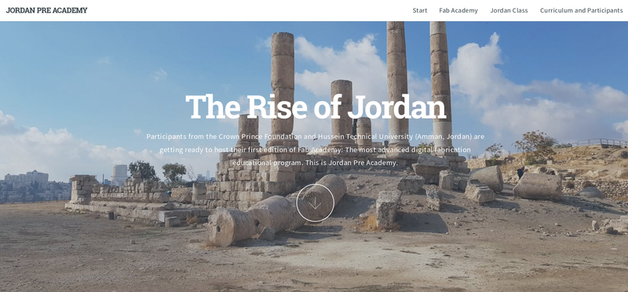
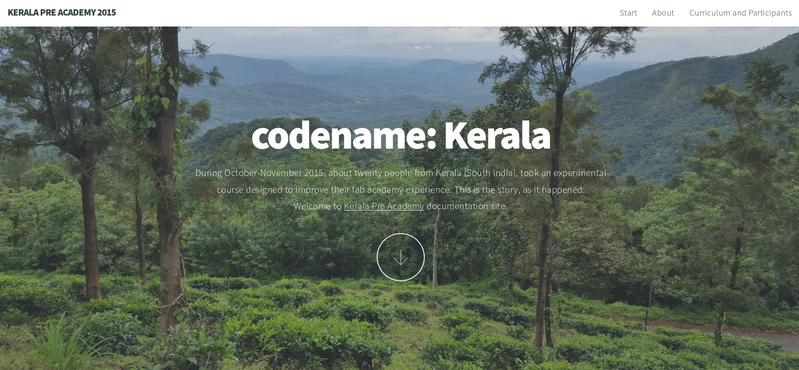

# Fab Zero Program (formerly Pre Academy)

Fab Zero is a high-density course originally designed to fill knowledge gaps and aimed to prepare students and labs to succeed and improve their experience during [Fab Academy](http://fabacademy.org). Fab Zero is **everything you should know before starting Fab Academy**. It has been also be adapted to prepare Fab Lab Managers. Topics covered include repository management, project documentation, lab preparation, fundamental electronics and programming, design thinking, machine operation, and many more.

This repository hosts the official curriculum of Fab Zero, which incorporates lessons learned during the follow-up of the participants in Fab Academy. Some changes include:
* Adding more design thinking and design principles
* Increasing time spent on documentation tools and repository management
* Increasing lessons in CAD (2D, 3D, parametric, advanced and simulation)
* It is now based in commonly used [FOSS](https://en.wikipedia.org/wiki/Free_and_open-source_software)
* Removing some topics that are common with Fab Academy

[Click here to go to Fab Zero official curriculum](summary.md)

# Fab Zero cycles

## Fourth iteration: Fab Zero Egypt 2019
The fourth and rebranded version of Fab Zero is expected to take place in Egypt during late 2018 and early 2019 (exact dates TBA). To be mentored by Francisco Sanchez and Sibu Saman to a group of managing teachers from a network of school labs all around the country.

## Third iteration: Pre Academy Jordan 2018
The third iteration of Pre Academy was tutored by Francisco Sanchez, Fiore Basile and Sibu Saman in late 2017 / early 2018 in Amman, Jordan to a number of participants of Hussein Technical University and the Crown Prince Foundation. Successful students were awarded a certificate issued by Fab Academy X during [Fab14](http://fab14.fabevent.org) in France.

[Go to Pre Academy 2018 students archive](http://fabzero.fabcloud.io/preacademy2018/)

## Second iteration. Pre Academy Kerala 2017
The second iteration of Pre Academy was tutored by Francisco Sanchez with assistance from Sibu Saman and Yadu Sharon (both from Kerala itself) in December 2016 to twenty professors of KTU Engineering colleges of the state of Kerala, South India. A certificate was issued by Fab Academy X during [Fab13](http://fab13.fabevent.org) in Santiago de Chile.

[Go to Pre Academy 2017 students archive](http://fabzero.fabcloud.io/preacademy2017)

## First iteration. Pre Academy Kerala 2016
The first official cycle of Pre Academy was tutored by Luciano Betoldi and Francisco Sanchez during October and November 2015. The course was taught in the state of Kerala, South India. There were 8 participants in Kochi and 14 in Thiruvananthapuram. Successful students obtained a certificate issued by Fab Academy X during [Fab12](http://fab12.fabevent.org) in China.

[Go to Pre Academy 2016 students archive](http://thebeachlab.github.io/)

# Questions and comments
This repository is maintaned and updated by Francisco Sanchez. If you have questions or inquiries about the course content please do not hesitate to raise an issue or contact me francisco [at] fabfoundation [dot] org. Happy to help!
