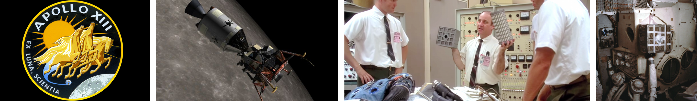

# Documenting your work

## What, why, how, where and when to document
The most important thing to understand when it comes to documenting your work is that **you are not writing a tutorial**, a step by step guide or telling others what to do. **You are telling your personal story**, your journey into the learning process. While you still have to provide details about your findings, you have to become a storyteller.

Documenting **is not about the final result, it's about the learning journey**. What was the goal, what did you had to research, how did you approach the solution, and what was the outcome. **Document both failures and successes**. There is a tendency to hide failures inherited from our educational system. In traditional education failure is negative. But there is much more you can learn from documenting your failures than documenting your sucesses.

The simplest explanation I can give you about **why do you have to document** is that [you have less recall memory than a goldfish](https://www.telegraph.co.uk/news/science/science-news/10937888/Memory-of-a-goldfish-Actually-fish-can-recall-events-12-days-ago.html). Actually **you will remember less than 60% after just 20 minutes** [(read more)](https://en.wikipedia.org/wiki/Hermann_Ebbinghaus). Document what you do **while you do it**. Exercise the habit of documenting every day.


*Forgetting curve by Hermann Ebbinghaus*

After writing your documentation, you will share it in one of the most universal formats, a static web page (HTML file).

## Writing documentation in markdown
Even though the final format of the documentation will be a webpage, ~~you will not write~~ I do not recommend you to write HTML code. There is a rising tendence to write documentation in **markdown** format. This is an example of documentation written in HTML code. It complex to write because there are all these tags that you have to open and remember to close like:
```html
<h1>This is the title</h1>
<p>This is a paragraph with some <strong>bold</strong> text.</p>
<ul>
    <li>This is first item of unordered list</li>
    <li>This is second item</li>
</ul>
```
The same thing as above looks like this in markdown:
```md
# This is the title
This is a paragraph with some **bold** text.
* This is first item of unordered list
* This is second item
```

Markdown is very **easy to write**, very **easy to read** and you can also **easily export to HTML** and other formats. In markdown you focus more in the content and much less in code tags which are prone to syntax errors.

A Markdown document is just a plain text file usually appended with a `.md` extension. It will only take you about 10 minutes to learn the basics following [this tutorial](https://www.markdowntutorial.com/).

> **Learning by doing:** Create a markdown page with a text editor and introduce yourself. Use header titles, bold text, italic text, link, bullets and an image.

> **Tip**
> 
> Some markdown headaches solutions learned the hard way
> 1. Standard markdown syntax does not require a blank line before a header. Pandoc (the tool that converts it to a webpage) does require  this (except, of course, at the beginning of the document). The reason for the requirement is that it is too easy for a # to end up at the beginning of a line by accident (perhaps through line wrapping).
>
> 2. If you need a line break, you must put two (or more) spaces at the end of the line.

### Markdown Workflow
The process of writing the documentation involves typing the documentation in markdown, converting it to HTML. We will first learn how to do all of these things manually, but they can automated them in a shell script.

### The text editor
You first need a text editor. I use [Visual Studio Code](https://code.visualstudio.com/) because it is Open Source and also has built in markdown preview, among many other useful things.

[MISSING: Visual Studio Code Image Placeholder]

> **Learning by doing:** Install Visual Studio Code

### Markdown to HTML conversion
To convert `.md` files to `.html` files there is a command line tool called **pandoc**. In Ubuntu you can install pandoc by typing this in the terminal:

`sudo apt-get install pandoc`

> **Learning by doing:** Install pandoc

When you convert to HTML, by default pandoc will export it unstyled, just like a plain HTML file written from scratch. But you can style your HTML using CSS by using the option `-c style.css`. Styling the resulting HTML is recommended not only because it looks nicer, but also because styling can make it easier and more pleasant to read. Which is an important feature for the documentation. Instead of writing your own `css` file from scratch, modify one of the many available `css` files for pandoc, or use [this one](http://git.fabcloud.io/francisco/beach-lab-htgaa-2015/blob/master/students/sanchez.francisco/base.css). Pandoc has several options. You can learn them by reading the manual, type `man pandoc`. The options we will use are:

```
-o html       # it tells pandoc the destination file format
-s            # creates a standalone document, not a fragment
-c style.css  # path or URL to a CSS stylesheet (optional)
```
So exporting a markdown file.md to file.html with a style.css stylesheet is:

`pandoc -s -t html -c style.css file.md -o file.html`

> **Think about it:** It's so annoying having to type all of those commands. Why do we keep using all these command line tools?

### Automating everything
Automation is the **real power of comand line tools**. You want to automate in order to avoid typing all these commands in terminal over and over and also in order to speed up the process of file conversion and uploading to the server.

All you need to do is to create a script, which is a plain text file names something like `auto.sh` (for _shell script_) where you will write a sequence of commands. Those will be the very same commands that you would type in the terminal one by one.

This tutorial assumes that you have all the markdown `.md` and css `.css` files together in the root of your student folder - which is inside the lab folder containing the github repository. Otherwise just adjust the paths accordingly. The script `auto.sh` can start simple, and towards time it will become more and more advanced as you master command line:

```bash
# Simple Automation file
# Step 1. Converting
pandoc -s -t html -c style.css file1.md -o file1.html
pandoc -s -t html -c style.css file2.md -o file2.html
```
> **Think about it:** Do you see any disadvantage in the above script?

```bash
# Advanced Automation file
# Step 1. File conversion from .md to .html
FILES=*.md
for f in $FILES
do
  # extension="${f##*.}"
  filename="${f%.*}"
  echo "Converting $f to $filename.html"
  `pandoc -s -t html -c base.css $f -o $filename.html`
done
```

### Using the script
Now it comes the easy part. After you type all your documentation you open a new terminal inside your student folder that contains `auto.sh` file and type:

`bash auto.sh`

And it search for all the `.md` files in your folder and will convert them to HTML, overwriting if they already existed.

> **Learning by doing:** Write a script to automate the conversion of your files to HTML.

## Adding multimedia to your documentation

### Pictures
* Resizing Images. You can resize and convert between image formats using [GraphicsMagick](http://www.graphicsmagick.org/) package. `gm convert -resize 600x600 bigimage.png smallimage.jpg` will resize `bigimage.png` without modifiyng the aspect ratio inside a bounding box of 600x600 pixels and convert it into `.jpg`.

* Image strip: It might be useful for documenting workflows to compose a strip of images using [GraphicsMagick](http://www.graphicsmagick.org/) package. `gm convert +append -geometry x400 image1.png image2.png image3.png image4.png strip.png`will compose 4 separate images in a `strip.png` image 400 pixels high.



### Video

* Selfie video: Many incubators and accelerators will ask you to record a video where you show you and your team. If you are planning to start a [kickstarter](https://www.kickstarter.com) campaign for a product you want to sell you will also have to do the same.


> **Learning by doing:** Record a 10 to 15 seconds video presenting yourself. Do you think it's easy? Let's see how many times you have to repeat the scene until you are satisfied.


* Screen recording: Sometimes the best way to show something that you are doing in a computer is with a screen capture video (with or without voice over). A good screen recorder for GNU/Linux is [SimpleScreenRecorder](http://www.maartenbaert.be/simplescreenrecorder/).
  
> **Learning by doing:** Record a 30 seconds video showing something you do on screen.

* The legacy `.gif` format might seem useful to show short videos (2 to 5 seconds) like a led blinking, **but it is very inefficient in compressing the video**. It is actually recommended that you convert them to `.mp4`. There are a number of resources for downloading, manipulating or converting `.gif` files like [Giphy](http://giphy.com/), [Ezgif](http://ezgif.com/video-to-gif) and many more.


* Experiment with adding titles and subtitles to your videos (in another language or for people with disabilities for example). Subtitles can be hardcoded or softcoded, find out the difference. You can create subtitles with YouTube Creator Studio.

---
[Back to Summary](../summary.md)
