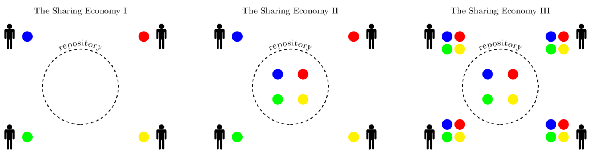

# Working with git repositories
<!-- TOC -->

1. [The community effect](#the-community-effect)
2. [Downloading a repository from Github](#downloading-a-repository-from-github)
3. [Installing git](#installing-git)
4. [Configuring git](#configuring-git)
5. [Cloning a repository using HTTPS connection](#cloning-a-repository-using-https-connection)
6. [Generating a SSH Keypair](#generating-a-ssh-keypair)
7. [Cloning a repository using a SSH connection](#cloning-a-repository-using-a-ssh-connection)
8. [Basic git workflow](#basic-git-workflow)
9. [Advanced git workflow](#advanced-git-workflow)
10. [Where is the webpage published?](#where-is-the-webpage-published)
11. [Troubleshooting](#troubleshooting)
    1. [Problem 1: I don't know what to do](#problem-1-i-dont-know-what-to-do)
    2. [Problem 2: Panic! Push error!](#problem-2-panic-push-error)
    3. [Problem 3: SSH connection not working. Is asking my password](#problem-3-ssh-connection-not-working-is-asking-my-password)

<!-- /TOC -->
> **Note:** As you go through this topic, do not try to memorize, learn by usage.

## The community effect

Imagine a community of 4 people, where everyone has a design and shares it. The balance is positive for all of them, since each one gives one and receives 3. The **most important** feature in sharing communities is that knowledge is amplified and **you always receive more that you give**.



In Fab Academy **we are working with git repositories**. Every lab has a git repository where students push their work and pull other people's work. The advantages of working with repositories rather than simple file sharing are countless: you can create branches, roll back changes, delete other people's files and many other things that you will ~~hate~~ love very soon.

## Downloading a repository from Github

[Github](github.com) is a web-based Git repository hosting. You don't need a github account or any software to download a zipped repository.

> **Learning by doing:** Visit GitHub and download a repository in zip format. Think of the inconveniences of proceeding that way.

## Installing git

For the next part of the course we will need to install [git](https://git-scm.com/). In Ubuntu type in a terminal window:

`sudo apt-get install git`

> **Learning by doing:** Install git in your laptop.

## Configuring git

Set some basic config and tell git who you are. I might not have to remind that, but please remember gentle reader, to replace **yourname** with your actual name and **youremail** with your actual email address.

```bash
cd ~/folder_name # replace this with your repository folder
git config --global user.name "yourname" #set name for commits
git config --global user.email "youremail" #set email for commits
git config --global push.default simple #default push only the current branch
git config --global core.editor atom #set the editor
```

> **Learning by doing:** Configure git with your personal data

## Cloning a repository using HTTPS connection

> **Note:** From now on you will need your [fablabs.io](fablabs.io) account.

To clone a repository you must type in a terminal window:

`git clone REPOSITORY_ADDRESS`

You can specify 2 kind of address depending on the connection used: HTTPS or SSH.

HTTPS connection is commonly used when you are cloning a repository that you will not be modifiying but you want to receive changes. It will not require login/password for each connection if the project is public.

> **Learning by doing:** Clone the class fab zero archive in gitlab using the https address. Your mentor will provide you with the address.
Did you need to authenticate? What does it mean?

Hopefully you will now have a folder containing the archive somewhere in your computer. But the problem is that if we want to push changes now it will require our login/password for each time we connect. Which is very inconvenient. So we will change the connection to SSH.

> **Learning by doing:** Delete the local folder containing the class repository. We will clone it again later

## Generating a SSH Keypair

We usually use SSH connection in git, that way we are not dealing with logins and passwords. A SSH connection needs a SSH keypair, one public key and one private key. These two together will allow you to establish an encripted connection. You can generate a ssh keypair by following [this tutorial](https://help.github.com/articles/generating-an-ssh-key/).

If you decide to define a passphrase at the time of generating the keypair, you will have to type it every-single-time you push to the archive. And this is going to be a lot of times. You have been warned.

After creating the ssh keypair, and adding it to the ssh-agent, you have to upload the public key to github/gitlab. For copying the contents of the public key to the clipboard you can just open it in any text editor, select all of it contents and copy it. I will use a command line tool called **xclip**. If you don't have it already, you can install it by typing:

`sudo apt-get install xclip`

And of course, read the manual `man xclip`. Say our public key name is `id_rsa.pub`, to copy its contents to the clipboard we do

`xclip -sel clip < ~/.ssh/id_rsa.pub`

And it is just a matter of pasting the clipboard in the SSH Keys section of github/gitlab. A piece of advice. Name that key in github/gitlab as the computer you are using. If you loose that computer or you feel that the key is compromised you will know what key to delete.

> **Think about it:** Can you have more than one key? Can you copy the keys to another computer?

## Cloning a repository using a SSH connection

This time locate the SSH address to clone the repository. In your computer, inside a terminal window, navigate to where you want to clone the repository (**recommended your home directory**):

```bash
cd ~  # actually it also goes to home if you just do cd
git clone paste-the-address-here.git
```

> **Learning by doing:** Clone the Fab Zero class repository in your computer using the SSH connection.

## Basic git workflow

This is the basic git workflow. Once you have made all changes to your website (hopefully daily), upload those changes to the repository. **Very important:** Do not miss any step, and do them in order.

```bash
cd ~/repositoryfolder     # go to the local repository folder
du -sh personalsubfolder  # check your subfolder size
git pull                  # pull other students changes
git add --all             # add your changes
git commit -m "message"   # write a meaningful message
git push                  # push to the archive
```

This is the manual workflow of updating your page. You can also write a script and [automate this process](doc.md).

> **Learning by doing:** What happens if you move the folder to another location? What happens if you rename the folder? Try to pull and push some changes after you rename or move the repository folder.

## Advanced git workflow


## Where is the webpage published?

Your mentor will give you the webpage address.

> **Learning by doing:** Bookmark this page

## Troubleshooting

### Problem 1: I don't know what to do

Solution: Do a `git status` and read

### Problem 2: Panic! Push error!

Solution: Stay calm. Read. The most common error at the push step is that after you pulled, and while you were typing the rest of the commands, someone (or several people) pushed their content to the archive. Just pull and push again. You can do that at the same time using:

`git pull && git push`

### Problem 3: SSH connection not working. Is asking my password

Solution: Sometimes git asks for the repository password even if you have specified to use SSH keys. So what you should do is check if the keys are in the **ssh-agent**:

```bash
ssh-add -l
Could not open a connection to your authentication agent.
```

In this case the **ssh-agent** is not running, so start it using:

```bash
eval `ssh-agent -s`
Agent pid 3032
```

Check again:

```bash
ssh-add -l
The agent has no identities.
```

Now the problem is that the agent has no identities. List the keys in your `.ssh` folder:

```bash
ls ~/.ssh
academy  academy.pub  config  known_hosts
```

I add your key, which is the key you added in gitlab

```bash
ssh-add ~/.ssh/your_key
Identity added: ~/.ssh/your_key (~/.ssh/your_key)
```

Check again:

```bash
ssh-add -l
2048 SHA256:D0Yg6HyzIzD9mIIpytearRhVc2YMYEtIpqP664EjEzU ~/.ssh/your_key (RSA)
```

An then, `git pull` and `git push` using SSH should work again.

> **Learning by doing:** If this happens to you frecuently, try to automate a solution

---
[Back to Summary](../summary.md)
