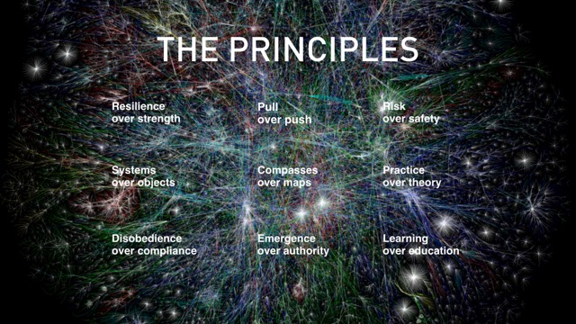
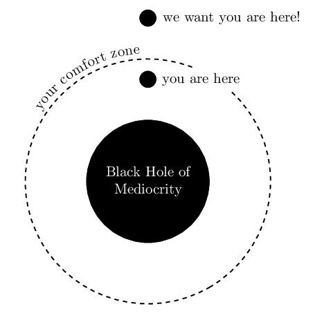

# Introduction to Pre Fab Academy. Getting ready

## Before we start: The notebook
For the Pre Academy and also Fab Academy **it is strongly recommended that you always carry with you a notebook** with around 100 non detachable pages that you will use **exclusively** for the course. Do not use separate sheets because it is highly probable that they will eventually end up lost and shuffled. Screenshots are helpful, but do not rely all your research in screenshots only.

Divide your annotations in entries. In every entry you can write:

* Date and time
* What you are doing, for what assignment (you will forget soon)
* Include machines used and settings
* Include workflows, protocols or procedures you are following
* Include troubles you are finding in the way, and how are you dealing with them
* Include a debugging table if you are debugging
* Finish the entry with a conclusion (Finished, to be continued later, stuck in a process, ...)

> Exercise: Get a notebook for the pre academy program and write down your first entry and answer in one sentence: Why are you here?

## Fab Labs and The Fab Lab Network

* History
* Cost of innovation
* [Fab Lab Charter](http://fab.cba.mit.edu/about/charter/)
* Equipment - [Inventory](https://docs.google.com/spreadsheets/d/1U-jcBWOJEjBT5A0N84IUubtcHKMEMtndQPLCkZCkVsU/pub?single=true&gid=0&output=html)
  * Collaboration
  * Standardization
* Conferences ([global](http://fab13.fabevent.org/), [regional]())
* [FabLabs.io](http://fablabs.io)
* [Fab Foundation](http://fabfoundation.org)

## Educational programs: The Academany

The Academany a short name for **The Academy of Almost Anything**, a new global educational structure offering high level education all over the globe, at connected sites offering the same infrastructure to all students. All courses that are part of The Academy of Almost Anything are **directed by people leading the way in their field**, and constantly evolve to stay at the cutting edge development of research into tools, technologies and techniques.

* [Fab Academy - HTMAA](http://fabacademy.org/)
* [Bio Academy - HTGAA](http://bio.academany.org/)
* [Fabricademy](http://textile-academy.org/)
* [Why to Make (almost) Anything - WTMAA](http://academany.org/design/) - [2017 Recitations](http://archive.fabacademy.org/archives/2017/master/lectures/index.html)
* Machines That Make - MTM (Upcoming)
* Will your program be the next?

### Academany methodology
Academany programs are not a traditional but a **distributed education system** with tutors instead of teachers. Students undertake their own research in a 5 months long program. Academany educational programs are inspired in line with [the nine principles](http://media.mit.edu/about/principles) from Joi Ito (MIT Media Lab).

### How Fab Academy works
* Every week a different topic.
* Basic principle is **Learn + make + share**. Based in the Scientific method
  * Learn: Weekly class by Neil Gershenferld (MIT) by videoconferencing system. Student undertakes its own research
  * Make: Hands-on with local instructor guidance to complete an assignment. Is an iterative approach strategy where time management is crucial
  * Share: Student documents the experience through a personal portfolio
* 3 levels of assesment
  * Student self-assesment: Student checks its progress against the [Assignments and Assessments](http://docs.academany.org/FabAcademy-Assessment/_book/) document.
  * Local evaluation: Local instructors make sure you meet the required standard
  * Global Evaluation: Completing students go through global evaluation process
* Graduation: Diploma vs Learning
* Links to previous years archives and important docs
  * [Archives](http://archive.fabacademy.org)
  * [Fab Academy Handbook](http://docs.academany.org/FabAcademy-Handbook/_book/). More than you want to know about Fab Academy
  * [Assignments and Assessments](http://docs.academany.org/FabAcademy-Assessment/_book/). How the Fab Academy program is evaluated

### Requirements to pass Pre academy
Pre Academy program will be awarded a Diploma if you meet the following requirements by the end of the program.
* Documentation
  * You are able to narrate the experience during the Pre Academy program
  * You use resized images and compressed videos where applicable
* Complete and document a final project that
  * Contains a microcontroller board that yoy have designed and fabricated with an input and output device
  * Uses at least 2 fabrication proceses in the Lab
  * You create a 1280x720 pixels `.png` slide
  * You create a 30s presentation 720p `.mp4` compressed video introducing you and your final project

### A piece of advice
* Do not follow existing roads, make your own path
* Move out of your comfort zone and stay there  

* Free your mind, forget what you already know, try new things
* Be brave, take risks (not physical risks)
* You will need to control your stress. Can you handle it?
  * Things will go wrong
  * things will change continuously
  * you will loose work
  * you will break things
  * you will not be able to find a solution immediately

> Exercise: Bookmark all these documents and pages

## Let's get ready!

### Safefy first
Health, Safety and Environment (HSE) guidelines.
* Cleaning up - Not someone else Problem
* Safety Manual
* Access control
  * Facility
  * Sensitive items
  * Machines
* Emergency Plan
  * Fire
  * Police
  * Hospital
  * Pharmacy

> Exercise: Walk around the lab. Identify HSE potential problems and write them down in your notebook.

### Prepare your Laptop
* The importance of FOSS software.
* Recommended Backups
  * Backup data to USB
  * Backup data to Cloud
* Installing a GNU/Linux distribution
* Installing software
  * Using GUI package managers
  * Install software using command line
  * Compiling software
* Installing Windows software using Wine
* WIP: Post-install script for [Ubuntu]() and [Arch]()

> Exercise: Backup your data, partition your hard drive and install Ubuntu-based distro in it

### Create online accounts
It is recommended that students create the following online accounts
* [Fablabs.io](fablabs.io) account. This is the official account used for many services
* [Google](google.com) account for all Google services (Docs, YouTube...)
* [Vimeo](vimeo.com) account for storing large videos. Alternative to Youtube.
* [Github](github.com) account for your personal code projects
* [Dropbox](dropbox.com) account for hosting large files
* [Sketchfab](sketchfab.com) account for embedding and hosting STL files

> Exercise: Create those online accounts and keep your usernames/passwords in a **safe** place
