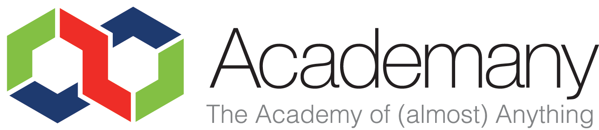
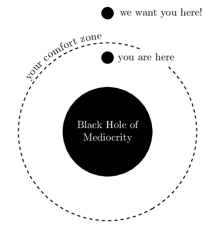

# Introduction to Fab Zero. Getting ready to unlearn

* [Fab Labs and The Fab Lab Network](#fab-labs-and-the-fab-lab-network)
* [Educational programs: The Academany](#educational-programs-the-academany)
  * [Academany methodology](#academany-methodology)
  * [How Fab Academy works](#how-fab-academy-works)
  * [Requirements to succeed in Fab Zero](#requirements-to-succeed-in-fab-zero)
  * [A piece of advice](#a-piece-of-advice)
* [Let's get ready!](#lets-get-ready)
  * [Prepare your Laptop](#prepare-your-laptop)
  * [Create online accounts](#create-online-accounts)

## Fab Labs and The Fab Lab Network

* History
* [Fab Foundation](http://fabfoundation.org)
* [Fab Lab Charter](http://fab.cba.mit.edu/about/charter/)
* Equipment - [Inventory](https://docs.google.com/spreadsheets/d/1U-jcBWOJEjBT5A0N84IUubtcHKMEMtndQPLCkZCkVsU/pub?single=true&gid=0&output=html)
  * Collaboration
  * Standardization
* Conferences ([global](http://fab13.fabevent.org/), [regional](https://fan4.fablabs.vn/))
* [FabLabs.io](http://fablabs.io)

## Educational programs: The Academany

The Academany a short name for **The Academy of Almost Anything**, a new global educational structure offering high level education all over the globe, at connected sites offering the same infrastructure to all students. All courses that are part of The Academy of Almost Anything are **directed by people leading the way in their field**, and constantly evolve to stay at the cutting edge development of research into tools, technologies and techniques.

* [Fab Academy - HTMAA](http://fabacademy.org/)
* [Bio Academy - HTGAA](http://bio.academany.org/)
* [Fabricademy](http://textile-academy.org/)
* [Why to Make (almost) Anything - WTMAA](http://academany.org/design/) - [2017 Recitations](http://archive.fabacademy.org/archives/2017/master/lectures/index.html)
* Machines That Make - MTM (Upcoming)
* Will your program be the next?

### Academany methodology

Academany programs are not a traditional but a **distributed education system** with mentors instead of teachers. Students undertake their own research in a 5 months long program. Academany educational programs are inline with [the nine principles](http://media.mit.edu/about/principles) from Joi Ito (MIT Media Lab).

### How Fab Academy works

* Every week a different topic.
* Basic principle is **Learn + make + share**. Based in the Scientific method
  * Learn: Weekly class by Neil Gershenfeld (MIT) by videoconferencing system. Student undertakes its own research
  * Make: Hands-on with local instructor guidance to complete an assignment. Is an iterative approach strategy where time management is crucial
  * Share: Student documents the experience through a personal portfolio
* 3 levels of assessment
  * Student self-assessment: Student checks its progress against the [Assignments and Assessments](http://docs.academany.org/FabAcademy-Assessment/_book/) document.
  * Local evaluation: Local instructors make sure you meet the required standard
  * Global Evaluation: Completing students go through global evaluation process
* Graduation: Diploma vs Learning
* Links to previous years archives and important docs
  * [Archives](http://archive.fabacademy.org)
  * [Fab Academy Handbook](http://docs.academany.org/FabAcademy-Handbook/_book/). More than you want to know about Fab Academy
  * [Assignments and Assessments](http://docs.academany.org/FabAcademy-Assessment/_book/). How the Fab Academy program is evaluated

### Requirements to succeed in Fab Zero

Fab Zero program will be awarded a Diploma if you meet the following requirements by the end of the program.

* Documentation
  * You are able to narrate the experience during the Fab Zero program
  * You are able to keep your file sizes low by using resized images and compressed videos where applicable
* Complete and document a final project that
  * Contains a microcontroller board that you have designed and fabricated with (at least) an input and output device
  * Uses at least 2 digital fabrication processes
  * You design a (beautiful) 1280x720 pixels `.png` presentation slide
  * You create a 30s compressed 720p `.mp4` presentation video introducing you and your final project

### A piece of advice

* Do not follow existing roads, make your own path  

* Move out of your comfort zone and stay there  

* Free your mind, forget what you already know, try new things
* Be brave, take risks (not physical risks)
* You will need to control your stress. Can you handle it?
  * Things will go wrong
  * Things will continuously change
  * you will loose work
  * you will break things
  * you will not be able to find a solution immediately

## Let's get ready!

### Prepare your Laptop

* The importance of FOSS software.
* Recommended Backups
  * Backup data to USB
  * Backup data to Cloud
* Installing a GNU/Linux distribution
* Installing software
  * Using GUI package managers
  * Install software using command line
  * Compiling software
* Installing Windows software using Wine
* WIP: Automatic Post-install script

> **Learning by doing:** Backup your data, partition your hard drive and install Ubuntu-based distro in it

### Create online accounts

It is recommended that students create the following online accounts:

* [Fablabs.io](fablabs.io) account. This is the official account used for many services
* [Google](google.com) account for all Google services (YouTube...)
* [Vimeo](vimeo.com) account for storing large videos. Alternative to Youtube.
* [Github](github.com) account for your personal code projects
* [Dropbox](dropbox.com) or similar account for hosting large files
* [Sketchfab](sketchfab.com) account for embedding and hosting STL files

> **Learning by doing:** Create those online accounts and keep your usernames/passwords in a **safe** place

---
[Back to Summary](../summary.md)
