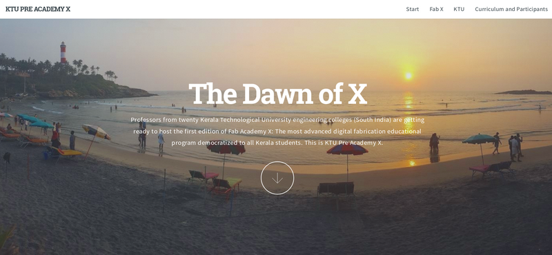

# Fab Zero cycles

## Sixth iteration: Fab Zero Bhutan 2022. Codename: The Last Shangri-la

For the first time after the pandemic started, Fran Sanchez and Sibu Saman visit the land of the thunder dragon. In this edition, a network of Fab Lab managers and engineers from Bhutan race against time and COVID to become one of the most innovative countries in the World.

## Fifth iteration: Fab Zero Egypt 2019. Codename: The Cradle

The fifth iteration took place in Egypt before the Fab Conference Fab15 in summer 2019. Is was mentored by Fran Sanchez and Sibu Saman to a group of managing teachers from a network of school labs all around the country.

## Fourth iteration: Fab Zero Bubhaneswar 2019. Codename: The Mango Tree

The fourth and re-branded version of Fab Zero is expected to take place in Bubhaneswar, India in early 2019 (exact dates TBA). To be mentored by Francisco Sanchez and Sibu Saman to a group of fab lab managers.

## Third iteration: Pre Academy Jordan 2018. Codename: The Rise of Jordan

The third iteration of Pre Academy was tutored by Francisco Sanchez, Fiore Basile and Sibu Saman in late 2017 / early 2018 in Amman, Jordan to a number of participants of Hussein Technical University and the Crown Prince Foundation. Successful students were awarded a certificate issued by Fab Academy X during [Fab14](http://fab14.fabevent.org) in France.

[Go to Pre Academy 2018 students archive](http://fabzero.fabcloud.io/preacademy2018/)

## Second iteration. Pre Academy Kerala 2017. Codename: The Dawn of X

The second iteration of Pre Academy was tutored by Francisco Sanchez with assistance from Sibu Saman and Yadu Sharon (both from Kerala itself) in December 2016 to twenty professors of KTU Engineering colleges of the state of Kerala, South India. A certificate was issued by Fab Academy X during [Fab13](http://fab13.fabevent.org) in Santiago de Chile.

[Go to Pre Academy 2017 students archive](http://fabzero.fabcloud.io/preacademy2017)

## First iteration. Pre Academy Kerala 2016. Codename: Kerala

The first official cycle of Pre Academy was tutored by Luciano Betoldi and Francisco Sanchez during October and November 2015. The course was taught in the state of Kerala, South India. There were 8 participants in Kochi and 14 in Thiruvananthapuram. Successful students obtained a certificate issued by Fab Academy X during [Fab12](http://fab12.fabevent.org) in China.

[Go to Pre Academy 2016 students archive](http://thebeachlab.github.io/)

---
[Back to Home](../README.md)
