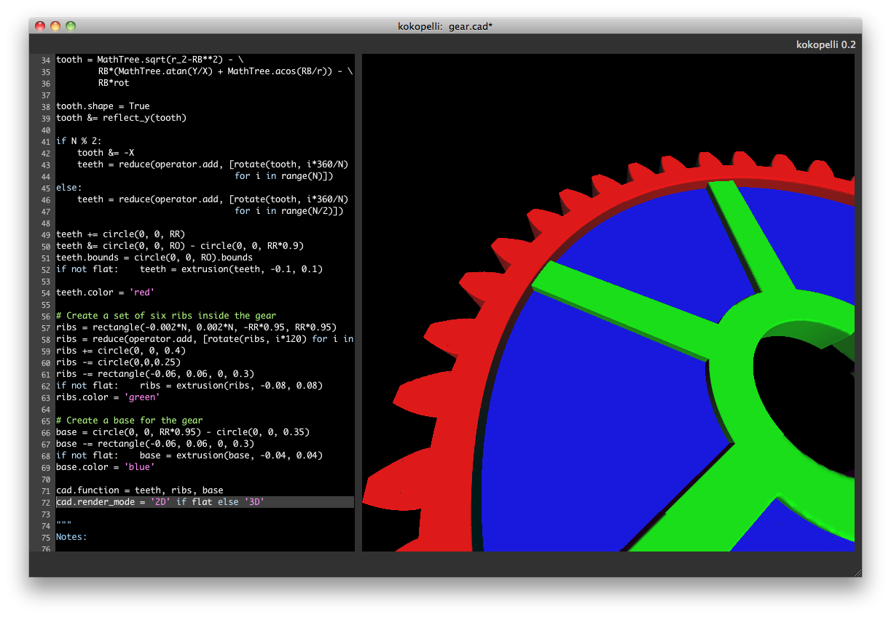
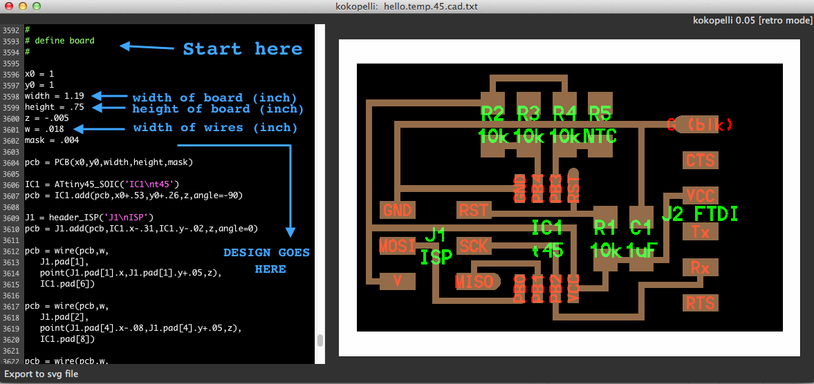

# Electronics design

> :construction: This documentation is WIP

* [Drawing your circuits](#drawing-your-circuits)
* [Eagle](#eagle)
* [KiCAD](#kicad)
* [Kokopelli Retro](#kokopelli-retro)
  * [A warning about kokopelli](#a-warning-about-kokopelli)
  * [Hands on: Modifiying a circuit board design in kokopelli](#hands-on-modifiying-a-circuit-board-design-in-kokopelli)
    * [Section 1: Defining the output](#section-1-defining-the-output)
    * [Section 2: Definitions](#section-2-definitions)
    * [Section 3: The design](#section-3-the-design)
      * [Adding a component](#adding-a-component)
      * [Placing wires](#placing-wires)
  * [Advanced kokopelli: Creating your own components](#advanced-kokopelli-creating-your-own-components)
  * [Advanced kokopelli: Non rectangular cutouts](#advanced-kokopelli-non-rectangular-cutouts)

Welcome to the amazing world of electronics design. We will learn tools and acquire some skills to be able to design our own circuit boards, which together with the skills of Electronics Production will allow us to fabricate our own circuit boards. And this is not only super cool, but also a huge step in digital fabrication. There are several ways you can create your electronics design. These are just some that we will cover:

* Drawing your circuit boards by hand. With the help of a template
* Using [Eagle](https://www.autodesk.com/products/eagle/overview)
* Using [Kicad](http://kicad-pcb.org/)
* Using [kokopelli](https://github.com/TheBeachLab/kokoretro) retro mode

Remember that in any case, what you will obtain is a black and white `.png` image for [fab modules](http://fabmodules.org) or [mods](http://mods.cba.mit.edu).

## Drawing your circuits

## Eagle

Even if you are not planning to use Eagle you **still ~~have~~ want to know the basics of Eagle** because you will find many designs out there using this format. You have to learn how to create the Schematic Design first and then the Design Layout. These are two half an hour tutorials:

[Tutorial 1: Schematic Design](https://www.youtube.com/watch?v=1AXwjZoyNno)
[Tutorial 2: Board Design](https://www.youtube.com/watch?v=CCTs0mNXY24)

## KiCAD

## Kokopelli Retro

[kokopelli](https://www.mattkeeter.com/projects/kokopelli/) was created by Matt Keeter and Neil Gershenfeld and is currently *abandonware*.



> Why do I want to waste my precious time in this obsolete and unsupported software that works for Linux only?  There are two reasons why you'd want to learn how to modify and design your circuit boards in kokopelli:
> 1. Because all the hello boards that Neil designs and are in this `.cad` format. Sooner or later you will come across one of them. He probably does so because of reason number two.
> 2. You are in Fab Academy because you want to turn codes into things(?). Eagle is just a specialized drawing program that makes your life easier when drawing circuits. On the other hand `.cad` is pure code and hence it is the closer you will be for turning codes into things. In the future, if there is such a thing like a programmable digital material, you will program it with something like kokopelli.

### A warning about kokopelli

This tutorial is only valid for kokopelli 0.05 version which can be found in [this repository](https://github.com/TheBeachLab/kokoretro). The newer (also abandoned) version of kokopelli [in Matt Keeter Github account](https://github.com/mkeeter/kokopelli) broke backwards compatibility with Neil `.cad` files.

### Hands on: Modifiying a circuit board design in kokopelli

You could start from scratch but the best thing is to start with any `.cad` file from Neil's design that resembles your final board.

The `.cad` file is just an almost 4000 lines of code text file. There are three main sections in this code.

#### Section 1: Defining the output

At the beginning there is a section for defining the output, that is, if you want to display the traces, the interior cutout or the board with labels, etc.


Just uncomment the desired output (just one at a time) and it will show on screen. Then use `Export/.png` in the top menu to export the image for milling (use at least 40 pixels/mm). For the Roland Modela you will need **traces and exterior** for milling the traces and also **interior** for the cutout. If your design has holes there is an output named **holes** as well that you will want to send to the Roland Modela before cutting the board. The output **traces, labels and exterior** is useful for stuffing the board and documenting your work.

#### Section 2: Definitions

There is a second section, which is the longest one, where there are many classes definitions for most of the components you will need. You don't need to modify this second section of definitions.

#### Section 3: The design

And finally at the end of the code there is another section where you actually design your circuit. That is the section you need to modify.



You can start by modifying the width and height of the board. You will notice that some components are linked to these parameters. You can also modify the width of the wires. Remember, the Roland Modela can go as down as 0.12 inch if you need it. Below these settings all what you will find are components and wires.

##### Adding a component

What you need to do to add a component in kokopelli is searching in the code for the definition of a matching class. For instance if you want to add a button, you guess... look for 'button' in the second section of the code and you will see a class named:

`class button_6mm(part):`

That is your boy. What you will do next is to define an instance of this button in the third section of code (give it an unique name like mybutton):

`mybutton = button_6mm('My\nButton');`

`\n` is used to break line in the name . You won't see anything on screen yet. Having done this you have to define the parameters for position and rotation of the instance created. It will always have this format:

`pcb=mybutton.add(pcb,x,y,z,angle=0)`

Where x, y z are the coordinates of the component and angle is the angle of the component (counterclockwise positive because we are dealing with math and that is the way angles are defined in math). For example:

`pcb=mybutton.add(pcb,0.2,0.1,0,90)`

It should appear on screen now. The nice thing of kokopelli is that you can set the coordinates relative to other components or variables. Coordinates can be like this:
```python
R2.x                 # Coordinate x of R2 component
LED1.pad[2].y        # Coordinate y of the pad number 2 of LED1
-0.3                 # Absolute coordinate
IC1.pad[5].x+.08     # 0.08 inch to the right from a component pad
```
So it could be like this:

`pcb=mybutton.add(pcb,R2.x,0.3,0,90)`

This is very useful when you want to keep a group of components together.

##### Placing wires

Now you only need to define wires that connect the pads of your component to other components or wires of the board. Wires always have this format:

`pcb = wire(pcb,w,point1,point2,...,pointn)`

The points is what you modify. w is the width parameter of the wires (which is defined at the beginning of the Section 3). You can use this w parameter or, maybe, for a certain wire, you might want to use a different one. You can have as many intermediate points as you want.

Every component has pad numbers. For instance the button_6mm class defines four pads left 1, right 1, right 2 and left 2 that correspond to numbers 1,2,3 and 4 (first pad defined is number 1 and so on). Lets say you want to connect pad 2 from the button, to pad 5 in the IC1:
```python
pcb = wire(pcb,w,      # w is the width of the wire
mybutton.pad[2],       # From pad number 2 of mybutton
point(0,1,0),          # (Optional) intermediate point(x,y,z)
IC1.pad[5])            # End point: Pad number 5 of IC1
```
What I usually do is just guess a pad number and then change the number if it is not the correct pad. Be careful because this is one of the main source of errors when designing in kokopelli.

Wires never go oblique in kopopelli, they will only go in X and Y direction and the first movement will always be horizontal. That means that if you place a wire from A to B it will go like this:
```
A--->---
       |
       |    #This is an awesome ASCII drawing
       B
```
If you want to change it, reverse the order of the points. So from B to A it will go like this:
```
A
|
|---<---B
```
That's it! The whole process is not that as hard as it might look like. It takes more time to explain it than actually doing it.

### Advanced kokopelli: Creating your own components

### Advanced kokopelli: Non rectangular cutouts

---
[Back to Summary](../summary.md)
