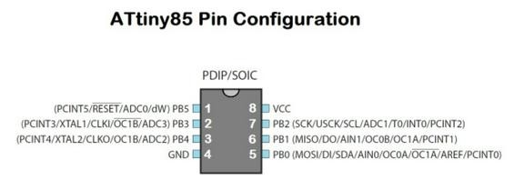
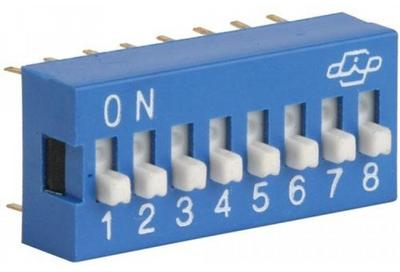

# Coding 101

Programming is a powerful skill. Not just useful, not just good for your career, not just a moneymaker, but powerful.

* [Introduction to embedded C programming](#introduction-to-embedded-c-programming)
* [Pseudocode](#pseudocode)
* [I know Arduino scripting language. I don't need C](#i-know-arduino-scripting-language-i-dont-need-c)
* [The datasheet](#the-datasheet)
* [Setting up AVR-GCC Toolchain on Linux](#setting-up-avr-gcc-toolchain-on-linux)
* [The basic idea behind a microcontroller](#the-basic-idea-behind-a-microcontroller)
* [Setting Inputs and Outputs. The DDR (Data Direction Registers)](#setting-inputs-and-outputs-the-ddr-data-direction-registers)
* [PORT Registers](#port-registers)
* [PIN Registers](#pin-registers)
* [Hello world program](#hello-world-program)
* [The button and LED program](#the-button-and-led-program)
* [Bitwise operations](#bitwise-operations)
* [Making your life easier: Macros](#making-your-life-easier-macros)
* [Compiling the program](#compiling-the-program)
* [The Makefile](#the-makefile)
* [The programmer](#the-programmer)

## Introduction to embedded C programming

In this section we are going to learn to program an attiny44 using AVR-GCC toolchain in C language. Programming is a huge topic. It will take long time to master.

For learning to code you **have to** code. There is a difference between **knowing** the path and **walking** the path. Walk-the-path.

* Basics about writing code
  * Important: Always add Author, date, description and license to the header of your code
  * Always comment your code
  * Init and loop sections
  * Digital output
  * Analog output (PWM)
  * Digital input
  * Analog input (ADC) 8 bit/10bit
  * Pull up / down resistors (10k)
  * Multitasking? Polling
  * Debounce buttons
* Embedded Programming. 3 levels depending on proficiency:
  * Beginners: Arduino IDE
  * Intermediates: C
  * Advanced: Assembly
* Why C? [https://www.youtube.com/watch?v=ERY7d7W-6nA&feature=youtu.be](https://www.youtube.com/watch?v=ERY7d7W-6nA&feature=youtu.be)
* Why Assembly? [https://en.wikipedia.org/wiki/Apollo_Guidance_Computer](https://en.wikipedia.org/wiki/Apollo_Guidance_Computer)

## Pseudocode


## I know Arduino scripting language. I don't need C

Please watch this video https://www.youtube.com/watch?v=ERY7d7W-6nA

## The datasheet

The first thing you should know about embedded programming is that **you cannot program a microcontroller without reading the datasheet** of that specific microcontroller.

> Download the [Attiny 44 Datasheet](http://www.atmel.com/images/doc8006.pdf) and browse through it.

## Setting up AVR-GCC Toolchain on Linux

For writing code you just need a text editor, like atom. AVR-GCC is a toolchain that will help you with the software development process, but doesn’t do anything about burning the final executable (the hex file) to the microcontroller. For that we need to install **AVR D**ownloader **U**ploa**DE**r (avrdude).

In Ubuntu

`sudo apt install avrdude gcc-avr binutils-avr avr-libc`

## The basic idea behind a microcontroller

A microcontroller is an electronic device with a CPU, memory and some other hardware that interfaces with the external world through a number of pins.


Some pins have a fixed function and cannot be changed, like VCC or GND. The rest of the pins can be configured as inputs (for receiving data from sensors) or outputs (to move motors or turn on lights).



The general workflow is that you hook your inputs and outputs to the microcontroller pins and then later in your code you program the logic that enables reading from the sensors and actions in the actuators. This way, someone with little knowledge in electronics engineering can design and program a circuit board.

## Setting Inputs and Outputs. The DDR (Data Direction Registers)

To tell the microcontroller if a pin is an input or an output we have modify a register called Data Direction Register. A register is like a DIP switch with 8 independently switches that can be set to 0 (off) or 1 (on).



There is one of these for each port A and B, named DDRA and DDRB.

By default all pins are configured as input.

> Exercise: Read this tutorial https://www.arduino.cc/en/Tutorial/DigitalPins

## PORT Registers

## PIN Registers

## Hello world program

```c
#define F_CPU 1000000UL
#include <avr/io.h>
#include <util/delay.h>

int main (void)
{

 DDRB = 0b00000100; // set PB2 as output in DDRB

 while(1) {
          // set PB2 high to turn led on
          PORTB = 0b00000100;
          _delay_ms(1000);
          // set PB2 low to turn led off
          PORTB = 0b00000000;
          _delay_ms(1000);
          }
}
```

## The button and LED program

```c
#define F_CPU 1000000UL
#include <avr/io.h>

// This program turns LED ON when the button is pressed

int main (void)
{

  DDRB |= (1 << PB2);
  // set PB2 as output in DDRB

  DDRA &= ~(1 << PA3);
  // set PA3 as input in DDRA

  PORTA = 0B00001000;
  // SET PULL UP RESISTOR IN PA3

 while(1) {
   if (testbit(PINA,PA3))

   PORTB = 0b00000000;
   // set PB2 low to turn led off

   else

   PORTB = 0b00000100;
   // set PB2 high to turn led on
        }
}
```

## Bitwise operations

## Making your life easier: Macros

Macros are

```c
#define setbit(register, bit)   (register) |=  (1 << (bit))
#define clearbit(register, bit) (register) &= ~(1 << (bit))
#define testbit(register, bit)  (register) &   (1 << (bit))
```

```c
setbit(PORTA, PA0)
clearbit(PORTB, PB3)
testbit (PORTA, PA2)
```

This makes your code much easier to understand. The precompiler will substitute the macros out at compile time and you will be left with the exact same code in your AVR.

## Compiling the program

## The Makefile

http://www.ladyada.net/learn/avr/avrdude.html

## The programmer

Do not start from scratch. Start by editing an existing program.

---
[Back to Summary](../summary.md)
