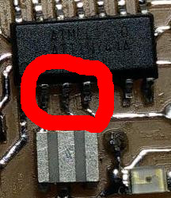

# Electronics 101

> :construction: This documentation is WIP

* [Learning about components](#learning-about-components)
* [Power sources](#power-sources)
* [Regulator](#regulator)
* [Decoupling Capacitor](#decoupling-capacitor)
* [Pull-up and pull-down resistors](#pull-up-and-pull-down-resistors)
* [Resonators and crystals](#resonators-and-crystals)
* [Diodes and LEDs](#diodes-and-leds)
* [Finding the value of a LED Resistor](#finding-the-value-of-a-led-resistor)
* [Switching](#switching)
* [Op-Amp](#op-amp)
* [Microcontrollers](#microcontrollers)
  * [Fuses](#fuses)
* [Troubleshooting](#troubleshooting)
  * [Using the multimeter](#using-the-multimeter)
  * [Using the oscilloscope](#using-the-oscilloscope)
  * [Using the function generator](#using-the-function-generator)
* [Advanced stuff](#advanced-stuff)

## Learning about components

Let's learn a little bit about how the components work. A good resource is the O'Reilly Encyclopedia of Electronic Components[.](files/books.zip) Do you know what are these components for and how do they work?

Here are a list of components you may encounter/find in FabLab inventory/projects.

---

## Power sources
* For Battery/Cells, look for
  * Primary vs Secondary (rechargeable)
  * SOT (State of Charge) vs Voltage
  * Internal resistance
  * Self Discharge
  * Shelf Life
  * Operating temperature
  * For rechargeable
    * Lifetime / Number of cycles
    * Memory Effect
    * Maximum sustainable discharge current limit (C rating)
    * Maximum burst discharge current limit
    * Maximum charging current limit
    * Maximum cell voltage
    * Minimum cell voltage

* AC-DC switching and non-switching
* Super Capacitor / Ultra capacitor / EDLC
* Photovoltaic

## Regulator

### Linear

### Low Drop Out (LDO)

### Buck, Boost, Buck-Boost, Charge Pump

---

## Decoupling Capacitor

## Pull-up and pull-down resistors

## Resonators and crystals

---

## Diodes and LEDs

### Finding the value of a LED Resistor

### Unidirectional Logic level shifter using Diodes

---

## Switching
  * BJTs
  * FETs
  * ElectroMechanical Relay
  * SSR, ** S**olid ** S**tate ** R**elay

## Op-Amp

## Input Devices / Sensors

* Optical
  * Photodiode
  * Phototransistor
  * Color Sensor
  * Optical Time of Flight Sensor
  * Camera
* Optical Proximity Sensor
* Audio
  * Microphone Audible/Ultrasonic
  * Ultrasonic Range Finder
* Temperature
  * NTC / PTC thermistor
  * Capacitive / step response
  * IR
* Humidity
* Accelerometer
* Gyroscope
* Magnetic
  * Simple hall Sensor
  * 3-axis compass
* IMU, ** I**nertial ** M**easurement ** U**nit
* Capacitive Touch Sensors
* Step response based custom Sensors

## Output Devices
* Mechanical
  * Brushed DC motor
  * BLDC, ** B**rush**L**ess ** DC** motor
  * Stepper Motors
    * Unipolar
    * Bi-Polar
  * Servo Motors
  * Synthetic Muscle
    * Nitinol
    * Nylon
  * Linear Motors\*
  * Pneumatic Actuator\*
  * Piezo\*
* Optical
  * LED, IR, Optical, UV, RGB, White
  * Laser diodes
* Audio
  * Speaker
  * Ultrasonic

## Communication Modules
  * Wireless
    * Bluetooth
    * WiFi
    * NRF 2.4GHz
    * LORA
    * NFC, RFID ...
    * Optical
    * ...
  * Wired
    * Ethernet
    * Serial RS-232, RS-485
    * CAN
    * I2C
    * ...

---

## Microcontrollers

### Fuses

Many microcontrollers, microprocessors and other chips have persistent (retains even after power cycle) configuration bits that defines many aspects of it's operation. You can go through the datasheet along with the documents below to understand the FUSE settings in AVR microcontrollers.

Wrong FUSE bits may not kill the chip but it may send it to 'coma' if you are not careful.

Fuses (HIGH, LOW, EXTENDED) Tutorial: [http://fabacademy.org/archives/2015/doc/fuses.html](http://fabacademy.org/archives/2015/doc/fuses.html)

The following is a nice tool to help you to determine the correct FUSE settings for the AVR microcontrollers.
[http://www.engbedded.com/fusecalc/](http://www.engbedded.com/fusecalc/)

---

# Troubleshooting

  The best way to learn is by experience. So, try to solve your problems on your own, find the fault using the tools, before approaching another person, before making a new circuit, blindly replacing components.

  One of the way I (sibu) learned a lot is by trying to fix my own gadgets.

  But, you need to know what to look for, and how to look. Try to understand the schematic diagram, it's much easier to understand than the layout. Then, you should learn from other people, see how they are doing it, and the best resources are the repair community.

  Generally speaking your eye is the best debugging tool, just look carefully, look again, look from a different angle.
  * Are you sure that the solder joints are perfect?
  * Check all the components. Are they where they are supposed to be? How about orientation.
  * Are they making a short circuit?
  * Is there any foreign objects like a small piece of solder, or leftover from colder wick that's causing a short?
  * Is there any bug? I mean a real bug, dead or alive causing a short, ** I'm not kidding.**
  * Look for corrosion.
  * ...

  For example, here is an example of the problem I faced during my(Sibu) FabAcademy.
  
  This is a tiny strand of copper leftover when I tried to wick away the excess solder.

  You may watch some videos from [Louis Rossmann](https://www.youtube.com/user/rossmanngroup), where you will find techniques to find common faults like short circuit, open circuit, solder joint failure, corrosion ...

  Also checkout repair videos from [EEVBlog](https://www.youtube.com/watch?v=h6D4MMWjrmM&list=PLvOlSehNtuHsc8y1buFPJZaD1kKzIxpWL).

## Using the Multimeter

You may find these useful.

[Diode mode for troubleshooting](https://www.youtube.com/watch?v=pRpyHF2dfq0)
[Yet another video](https://www.youtube.com/watch?v=fh4hpM8JyvM)

## Using the oscilloscope

## Using the function generator

---

## Advanced stuff

Just to scare some people...

### Surge, Transient protection

### ESD protection, TVS diodes

### Noise, EMI, Shielding

### High Speed Circuit Design, Impedance, Parasitic elements

---
[Back to Summary](../summary.md)
