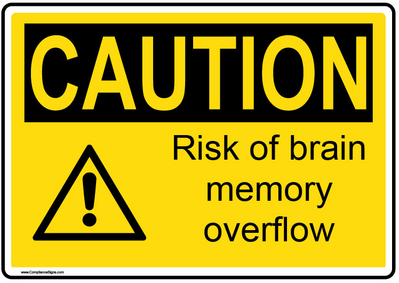

# Official Fab Zero Documentation

This documentation is WIP. Estimated release date: December 2018

This is **not** a novel. Do **not** attempt to follow these topics from the beginning till the end, one after the other. They are designed to be **mixed-up and spreaded** over the course. Your mentor will design and adjust an adequate **learning path** for the group.

## Introduction to Fab Zero
* [From Zero to Hero! Getting ready to unlearn](basic/intro.md)
* [The Linux Command Line](basic/commandline.md)
* [Documenting your work](basic/doc.md)
* [Working with git repositories](basic/git.md)
* [By tomorrow?! Time and project management](basic/projectmanagement.md)

## Design is a process, not a result
* [Principles of Design](design/designprinciples.md)
* [In the beginning. The Design Thinking strategy](design/designthinking.md)
* [Going Analog in a Digital Age](design/analog.md)
* Digital 2D Design
	* [2D Raster and Vector](design/cad2d.md)
* Digital 3D Design
	* [Parametric CAD with FreeCAD](design/freecad.md)
	* [The code approach. CAD with OpenSCAD](design/openscad.md)
	* [Advanced CAD](design/advancedcad.md)
	* [Break it before you make it! Structural Simulation in FreeCAD](design/simulation.md)

## Do not push this button! Interacting with machines and processes
* [Vinyl cutter, the underestimated machine](machines/vinyl.md)
* [Laser cutter, the abused machine](machines/laser.md)
* [3D Printing, the overhyped machine](machines/3dprint.md)
* [3D Scannner, the forgotten machine](machines/3dscan.md)
* [Shopbot CNC Router, the dangerous machine](machines/shopbotcnc.md)
* [Maintenance. No, machines do not clean themselves](machines/maintenance.md)
* [Boston, we have a problem. Troubeshooting and support](machines/troubleshooting.md)

## Making things move. Electronics and programming
* [Basic Electronics. For people who doesn't understand the difference between a resistor and a capacitor](w4/electronics101.md)
* [The fabber way to make a circuit board](electronics/production.md)
* [Ready player 2. Design your own circuit board](electronics/circuitdesign.md)
* Programming circuit boards
	* [Introduction to programming](electronics/code101.md)
	* [Advanced Programming. Interrupts](electronics/interrupts.md)
	* [Adnaced Programming. Timer Interrupts](electronics/timerinterrupt.md)
	* [Advanced programming. Timers](electronics/timercounter.md)
	* [Advanced Programming. PWM](electronics/pwm.md)
	* [Advanced Programming. ADC](electronics/adc.md)
	* [Programming in Assembly. The NASA Style](electronics/assembly.md)
* [Software interfaces for physical devices](electronics/softinterface.md)
* [Physical Interfaces for computer software. The other way around](electronics/hardinterface.md)

## Lab Management. The mess is under control
* [This way please. Managing layout and people's flow](lab/layout.md)
* [Chaos and order. Balance is the key](lab/chaos.md)
* [Documentation. Why tomorrow you will not remember anything](lab/doc.md)
* [Where are the tweezers? Inventory Management](lab/assets.md)
* [Keep in touch! Mastering the video conferencing systems](lab/video.md)

## Now all together. The Final Project
* [The untold truth about Final Projects](final/finalproject.md)
