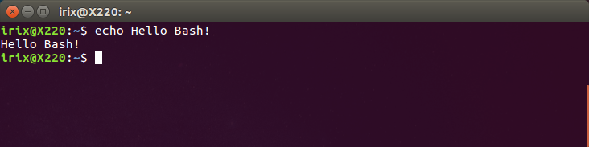

# Linux Command line 101

## Command line?
We are all familiar with programs that have a **Graphical User Interface** (GUI), but in reality this is just an interface for showing us information and interact with the actual program. The actual programs are running in the background.

But programs can also be run without the GUI and actually many programs come without a GUI. So the way to interact with these programs is through the **Command Line**.

The enviroment we use is the Shell or command-line interpreter. There are many shells. The one that comes with most distributions is **Bash** (Bourne Again Shell).



## The Unix philosophy
It is important to understand the [Unix philosophy](https://en.wikipedia.org/wiki/Unix_philosophy) before you move forward. Programs in Unix were written following this philosophy:

* Unix programs do one thing and do it well.
* Unix programs are designed to work together.
* Unix programs are designed to handle text streams, because that is a universal interface.

So Unix (and Linux programs) usually perform a single task only. They are not multipulpose complex programs. To achieve complex behaviours the output of a program can be piped (more on this later) to another program. keep this is mind.

## Basic syntax
The command line syntax is a mandatory `COMMAND` with optional `OPTIONS` and optional `ARGUMENTS`. For example, copy the following and paste it in the command line:
```
ls -a /usr/local/bin
```

> ### Something's wrong! Copy and paste keys are not working
The usual copy and paste key combinations have different functions in Bash. To copy text in Bash, select it and press `CONTROL`+`SHITFT`+`C`. To paste text in Bash use the arrow keys to go to the desired location and use `CONTROL`+`SHITFT`+`V`.

`ls` is a command which lists files and folders. `-a` is an option to display hidden files and `/usr/local/bin` is the argument telling where to operate the command. If the argument was not present it would list the current directory.

>### Wait, wait, wait... Do I need to memorize all of this?
No. Just use the `man` COMMAND (for Manual) everytime you need help on how to use the commands. Yes, I know. We all hate manuals. But in Unix/Linux world you will find a lot of references about [RTFM](https://en.wikipedia.org/wiki/RTFM).

> Exercise: Have a quick look at the manual for `ls` command. We will need this in a while.

Options come in two flavors, one is called **short option**, a single letter like `-a`. In this case you don't have a clue of what that option is performing. On the other hand you can concatenate short options. For example `-a -l` can be reduced to `-al`.

> **Remember:** Linux is a case sensitive operating system. `-n` and `-N` are different things!

Some options also have a human readable flavor called **long option**. Human readable options are prefixed with two dashes `--` and they give you a clue of what that option is doing. For example the long option of `-a` is `--all`, giving you the clue that it will list all the files and folders, including the hidden ones. Long options cannot be concatenated.

> Exercise: List the files of your home folder. Display them as a list. Display the hidden files also. What other options can be useful?

## Navigating the filesystem
### Where am I?
The information displayed in Bash varies from distribution to distribution. In Ubuntu you can see at every moment what is the current directory and the full path. Otherwise `pwd` command (_Print Working Directory_) will output the full path of your location in the filesystem.

> Exercise: Open a new terminal window. Where are you now? What is ~?

### Moving around
`cd` command stands for *change directory* and it is used to go to other directories.

> Exercise: Navigate to your root folder /

If you need to navigate to a folder with spaces like *My Documents* use the escape character `\` to tell bash that the space is part of the name and not another argument:

`cd My\ Documents`

If you need to go back to the last directory you were you can use the command `cd -`. This is very useful to go back and forward between 2 directories.

### Tab completion
A very handy keyboard shorcut is the `TAB` key. It will autocomplete the name of the file or the folder name.

> Exercise: From the root folder, navigate to your Documents folder. Use `TAB` to keep autocompleting.

### Listing contents
We have seen the `ls` command already. Most of the time you will use `ls -lh` (with optional `-a`) which gives you a long list with human readable file sizes.

The first column tells you if the item is a file `-`, a directory `d`, or a link `l`. Then you can see the permissions, owner, group, date, file size, and name.

> Exercise: List and analyse the contents of your `/usr/bin`. What do you see?

### Creating, moving and deleting files and folders
`mkdir` is used to create a directory

> Exercise: Create a personal folder using this scheme `surname.name` in your `~/Documents` folder.

If you need to create a folder structure you can use the option `-p` which will create all the required parent folders.

> Create `~/Documents/surname.name/week1/img`

`touch` command is used to create an empty file.

> Exercise: create a file named `readme.md` inside your personal folder. Check that the file is there.

`rmdir` removes empty directories.

> Exercise: Try to remove your personal folder. Ouch. What's the problem?

`cp` is a command used to copy files and folder. It has many options but the basic usage is `cp origin destination`.

> Exercise: Copy your `readme.md` to `day1.md`

`mv` is used for moving files but can also me used as a rename tool.

> Exercise: Rename `day1.md` to `week1day1.md`. Remember to use `man mv` if you don't know how to use the command.

When moving files from other directories to the current directory you can use the shortcut `.`

> Example: `mv ~/Downloads/somefile.zip .`

At all time we can use w ildcards like `*` that represents any number of any characters and `?` that represent one of any character.

`rm` can be used to remove files and folders

> **Warning:** There is no trash can in the command line. You delete a file and the file is gone forever. Be be careful with this command.

You can use `rm` recursively to delete files and folders

> Example `rm -r ~/Documents/surname.name/` will delete the folder and everything inside it. Extreme caution!

### Finding files and folders
`find` will recursively search for files and folders inside a specified starting location. For example, to find files and folders anywhere inside your home folder which contains "1":

`find ~ -name "*1*"`

This command has many other options, explore the manual if you want to learn more.

### File sizes
One of the things you ~~should~~ must do before pushing your files to the archive is checking your files sizes. That way you make sure you are not accidentally uploading 16Mpx pictures, a large video or huge STL meshes (to name just three of the most common mistakes).

The reason why this is important, has an answer in how version control systems are designed. They are designed to keep history. That's why once you upload something by mistake, even if you delete it, it remains in the history and it is very difficult to remove it.

`du -sr myfolder`

A normal alchive should grow at a rate of 1-2 mb per week.

### Understanding users, groups and permissions
Linux is a multi-user operating system with users and groups. Different users have different file access levels or privileges (read, write, execute). By default bash tells you what user is logged in. Otherwise you can ask bash _Who am I?_

`whoami` command will tell you who you are.

`chmod` will change the permissions of a specified file or device.

### sudo

`sudo` stands for _Super User Do_ and it will perform tasks as if you were the root user. For instance, if you want to move one file out of your home folder you will be denied permission. To do that you will have to execute the command you want to perform So you will be able to install software, look into other users home folders, and other administrative tasks.

`sudo mv somefile.txt /`

As soon as you have performed you administrative tasks you should revert back to your user privileges. You can withdraw yourself from admin privileges with `sudo -k`.

You can also switch user with `su` command. Being the most common use when you want to become root `sudo su`. Exit to your normal user as soon as you finish with `exit` command.

### Looking inside files

`cat` will display your file on the screen. You can also use option `-n` to number the lines.

`cat -n somefile.txt`

`head` and `tail` commands will show the first and lastest 10 lines of a file. You can change this number of lines displayed by using the option `-n`

`tail -n 5 somefile.txt`

`less` is used for browsing long files, it will display the file you specify using the `man` command line viewer.  

`grep` is a very useful command. It looks for text inside files.

### Piping commands

---
[Back to Summary](../summary.md)
