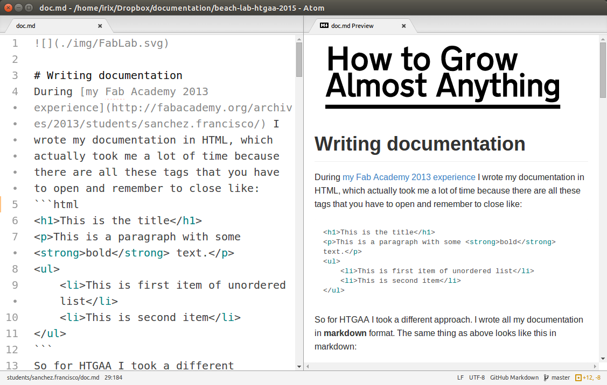

# Writing damn good documentation

## The computer

### Writing documentation in markdown
This is an example of documentation written in HTML code. It takes time because there are all these tags that you have to open and remember to close like:
```html
<h1>This is the title</h1>
<p>This is a paragraph with some <strong>bold</strong> text.</p>
<ul>
    <li>This is first item of unordered list</li>
    <li>This is second item</li>
</ul>
```
There is a rising tendence to write documentation in **markdown** format. The same thing as above looks like this in markdown:
```md
# This is the title
This is a paragraph with some **bold** text.
* This is first item of unordered list
* This is second item
```

Markdown is very **easy to write**, very **easy to read** and you can also **easily export to HTML** and other formats. In markdown you focus more in the content and much less in code tags which are prone to syntax errors.

A Markdown document is just a plain text file usually appended with a `.md` extension. It will only take you about 10 minutes to learn the basics following [this tutorial](https://help.github.com/articles/markdown-basics/).

> Exercise: Create a markdown page with a text editor and introduce yourself. Use header titles, bold text, italic text, link, bullets and an image.  

>### Some tips learned the hard way
> Standard markdown syntax does not require a blank line before a header. Pandoc  does  require  this (except, of course, at the beginning of the document). The reason for the requirement is that it is all  too  easy for  a  #  to  end  up  at the beginning of a line by accident (perhaps through line wrapping).
>
> If you need a hard line break, put two or more spaces at the end of a line.

### Markdown Workflow
The process of writing the documentation involves typing the documentation in markdown, converting it to HTML, and pushing the documentation to the archive. We will first learn how to do all of these things manually, but they can automated them in a shell script.

#### The text editor
You first need a text editor. I use [Atom](https://atom.io/) because it is Open Source and also has built in markdown preview. To activate the markdown preview in Atom clic on _Packages/Markdown Preview/Toggle Preview_ or press `SHIFT`+`CONTROL`+`M`.



> Exercise: Install atom

#### Markdown to HTML conversion
To convert `.md` files to `.html` files there is a command line tool called **pandoc**. In Ubuntu you can install pandoc by typing this in the terminal:

`sudo apt-get install pandoc`

> Exercise: Install pandoc

Pandoc has several options. You can learn them by reading the manual, type `man pandoc`. The options we will use are:
```
-f markdown  #it tells pandoc the origin file format
-o html      #it tells pandoc the destination file format
-s           #creates a standalone document, not a fragment
-c style.css #path or URL to stylesheet
```
So exporting a markdown file to html is:

`pandoc -s -f markdown -t html -c style.css file.md file.html`

When you export to HTML, by default pandoc will export it unstyled, just like a plain HTML file written from scratch. But you can style your HTML using CSS by using the option `-c style.css`. Styling the resulting HTML is recommended not only because it looks nicer, but also because styling can make it easier and more pleasant to read. Which is an important feature for the documentation. Instead of writing your own `css` file from scratch, modify one of the many available `css` files for pandoc, or use [this one](http://git.fabcloud.io/francisco/beach-lab-htgaa-2015/blob/master/students/sanchez.francisco/base.css).

Some people will ask *why do we keep using command line tools like pandoc? It's so annoying having to type all of those commands*. Continue reading to find out why.

#### Automating everything
Automation is the **real power of comand line tools**. You want to automate ~~because you are lazy bastard like me, admit it~~ in order to avoid typing all these commands in terminal over and over and also in order to speed up the process of file conversion and uploading to the server.

All you need to do is to create a script, which is a plain text file names something like `auto.sh` (for _shell script_) where you will write a sequence of commands. Those will be the very same commands that you would type in the terminal one by one.

This tutorial assumes that you have all the markdown `.md` and css `.css` files together in the root of your student folder - which is inside the lab folder containing the github repository. Otherwise just adjust the paths accordingly. The script `auto.sh` can start simple, and towards time it will become more and more advanced as you master command line:

```bash
# Simple Automation file
# Step 1. Converting
pandoc -s -f markdown -t html -c style.css file1.md file1.html
pandoc -s -f markdown -t html -c style.css file2.md file2.html
# Step 2. Uploading to the archive
git pull
git add --all
git commit -m "updates"
git push
```
> Do you see any disadvantage in the above script?

```bash
# Advanced Automation file
# Step 1. File conversion from .md to .html
FILES=*.md
for f in $FILES
do
  # extension="${f##*.}"
  filename="${f%.*}"
  echo "Converting $f to $filename.html"
  `pandoc -s -c base.css $f -t html -o $filename.html`
done
# Step 2. Uploading everything to the repository
# If there is commit message then upload
if [ "$#" -gt 0 ]
then
    git pull
    git add --all
    git commit -m "$*"
    git push
else
    echo "Not uploading (Empty commit message)"
fi
```
> Note: Please note that the `git commit` line contains a `$*`. This is important since we will [pass the commit message as an argument](http://osr600doc.sco.com/en/SHL_automate/_Passing_to_shell_script.html) when we execute the script.

#### Using the script
Now it comes the easy part. After you type all your documentation you open a new terminal inside your student folder that contains `auto.sh` file and type:

`bash auto.sh`

And it search for all the `.md` files in your folder and will convert them to HTML, overwriting if they already existed. But **if you also write a commit message** like this:

`bash auto.sh this will be the commit message`

This will convert all the markdown documentation to HTML **and** upload the documentation to your repository (if you uncommented the ftp line it will also ask you the ftp password).

> Exercise: Write a script to automate the conversion of your files to the repository.

### Audio and video
* Selfie video: Many incubators and accelerators will ask you to record a video where you show you and your team. If you are planning to start a [kickstarter](https://www.kickstarter.com) campaign for a product you want to sell you will also have to do the same.

> Record a 10 to 15 seconds video presenting yourself. Do you think it's easy? Let's see how many times you have to repeat the scene until you are satisfied.


* Screen recording: Sometimes the best way to show something that you are doing in a computer is with a screen capture video (with or without voice over). A good screen recorder for GNU/Linux is [SimpleScreenRecorder](http://www.maartenbaert.be/simplescreenrecorder/).

> Record a 30 seconds video showing something you do on screen.

* Do not underestimate the legacy `.gif` format. It is very useful to show short videos (2 to 5 seconds) like a led blinking. It also shows your emotions and helps the people understand how do you feel doing fab academy. It does not require autoplay. There are a number of resources for downloading, manipulating or converting to `.gif` like [Giphy](http://giphy.com/), [Ezgif](http://ezgif.com/video-to-gif) and many more.


> Include one of these GIF in your archive.   

* Experiment with adding titles and subtitles to your videos (in another language or for people with disabilities for example). Subtitles can be hardcoded or softcoded, find out the difference. You can create subtitles with YouTube Creator Studio.
---
[Back to Summary](../summary.md)
