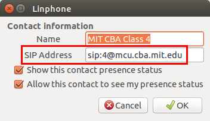
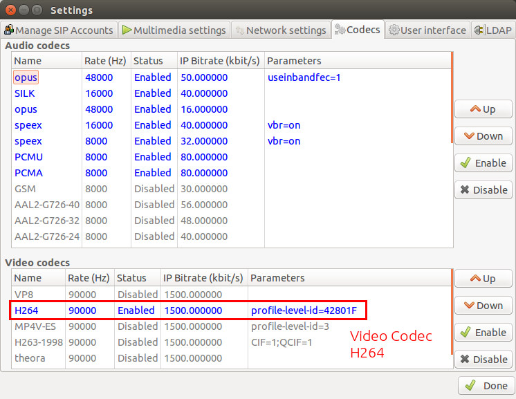
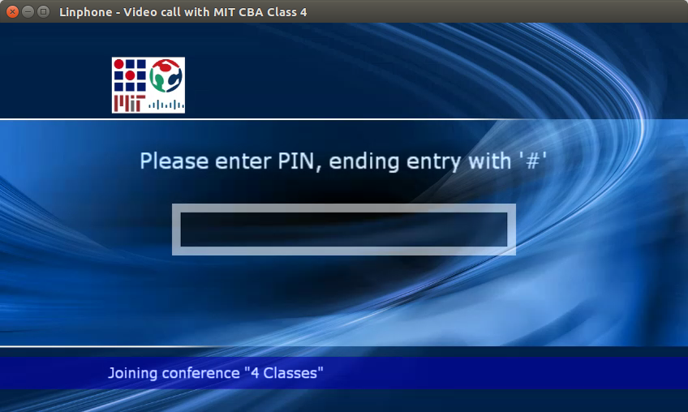
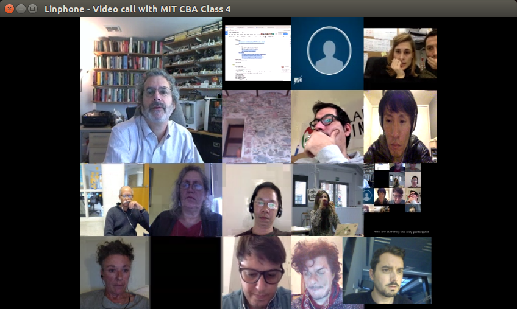

# Day 1. Introduction to Pre Fab Academy. Getting ready

## What is Fab Academy X?

* Fab Labs
  * History
    * Neil’s Day 1 Presentation
    * Fab Lab Charter
* Objectives
* Equipment
  * Inventory
* Fab Lab Network
  * Collaboration
  * Standardization
  * Conferences
  * FabLabs.io
  * Fab Foundation
* Academany
* Fab Academy X @ KTU and “The Kerala Experiment”
  * Pioneering project
  * First step in something bigger
  * Expand to match FabAcademy

## Methodology
* [The nine principles](http://media.mit.edu/about/principles). MIT Media Lab
* Traditional Education vs Distributed Learning
* Tutors vs. teachers
* Personal Research
* No roads
* Free your mind \(forget what you already know\)
* Be brave, Take risks \(not physical risks\)
* Stress control. Can you handle it?

## How Fab Academy X works
* Weekly Assignments
* Documentation
* Learn + make + share. Every week a different topic.
* Iterative approach
* Scientific method
* Graduation: Diploma vs Learning
* Links to previous years archives and important docs \(manual, grading sheets etc.\)

## Preparing yourself for the course ahead

### Your Laptop
* The importance of FOSS software.
* Recommended Backups
  * Backup data to USB
  * Backup data to Cloud
* Showing how to install latest Ubuntu Desktop LTS
* Showing how to install software using Ubuntu software center
* Showing how to install software using apt-get
* Showing how to compile software
* Showing how to install Windows software using wine
* Showing basic command line for ubuntu
* Assignment: Install list of software
  * “Terminal here” addon for Nautilus
* Inkscape
* Openscad
* Gimp
* Cura
* Arduino IDE (not the ubuntu software center version)
* Attiny addon for arduino IDE (Instructions in tutorial section of Hi Lo Tech MIT Media Lab)
* Processing
* Qcad
* FreeCAD
* Geogebra
* Blender
* Meshlab
* Krita
* mtPaint
* MyPaint
* Libreoffice
* Slic3r
* SimpleScreenRecorder
* Git
* Eagle
* Kicad
* Wine
* Partworks in wine
* Text editor of your choice (Atom, Brackets...)

**Remote desktop:**

* [TightVNC](http://www.tightvnc.com/)
* [x11vnc](http://www.karlrunge.com/x11vnc/)
* [noVNC](https://github.com/kanaka/noVNC)

## Accounts
It is recommended that students create the following online accounts
* [Fablabs.io](fablabs.io) account
* [Google](google.com) account for all Google services (Docs, YouTube...)
* [Vimeo](vimeo.com) account for storing large videos
* [Github](github.com) account for your personal code projects
* [Dropbox](dropbox.com) account for hosting large files
* [Sketchfab](sketchfab.com) account for embedding and hosting STL files

> Exercise: Create those online accounts and keep your usernames/passwords in a safe place

## Preparing the lab. Health and Safety
* Cleaning up - Not someone else Problem
* Safety Manual
* Access control
  * Facility
  * Sensitive items
  * Machines
* Emergency Plan
  * Fire
  * Police
  * Hospital
  * Pharmacy


## Videoconferencing
Fab labs are connected through a MCU videoconferencing system

### Installing and running Linphone
Installing the latest release of Linphone in Ubuntu is easy typing in a terminal window:

```
sudo add-apt-repository ppa:linphone/release
sudo apt-get update
sudo apt-get install linphone
```

After installation just type `linphone` in a terminal window to execute it.

> Exercise: Install Linphone in your laptop and launch it.

### Configuration
The image shown below is the main window that appears after executing Linphone. In here you can type a **SIP** address and press the _call button_ to connect, but it is preferable that you create a new contact, since you will be calling the videoconferencing system several times:


In the contact window create the following contacts. The address for the main menu screen in the MCU is `sip:mcu.cba.mit.edu` if you are connecting from a lab or `sip:mcuc.cba.mit.edu` (note the **c**) if you connecting as ~~an individual~~ a student group (**please note individuals are not allowed to connect to the MCU**). In the main menu you can select which room to join using the _keypad_ (see later below). You can also create a direct access to class room 4 (the lectures channel) adding `4@` after `sip:`. This is very convenient since you can save time when reconnecting. Just remember that if you are connecting from a lab create `sip:4@mcu.cba.mit.edu`, if you are connecting as ~~an individual~~ a student group use `sip:4@mcuc.cba.mit.edu` (note the **c**) instead.



> Exercise: Create contacts for a) MCU b) MCU Room 4

It is now time to configure the connection. With the main window focused go to `Options/Preferences` in the menu bar. A new window with several tabs will appear. The first one is the **Manage SIP Accounts tab**. In this tab it is strongly recommended that you run the _wizard_ to create a proxy account on linphone.org, because many routers have blocked ports that you need to connect. You can also choose here **the name that will be shown to other participants**.


In the **Multimedia settings tab** select the specific hardware that you might have like the Logitech C920 Camera or the Echo Cancelling microphone from the inventory, if you have them. **In case your microphone already has a built in echo cancellation disable the _Enable echo cancellation_ option**.


In the **Network settings tab** check _Set Maximum Transmission Unit_ acording to your upload speed. If you have a 1 Mbps upstream connection it would be safe to leave this a 700:


Finally in the **Codecs tab**, make sure that you have enabled the H264 codec. If you don't have this coded listed you might have to install it first.



> Exercise: Configure Linphone

### Connecting to Class
Connect to the class clicking in your Class 4 contact or typing in the address bar:

`sip:4@mcu.cba.mit.edu`



And enter the **PIN** number followed by the pound key **#**, not using your keyboard but the keypad window (to show the keypad window go to `Options/Show Keypad` in the menu bar). Please do not ask me for the PIN number. This number will be given to you by your local or remote tutor when you join the course. PINs for `mcu` (lab connection) and `mcuc` (~~individual~~ student group connection) are different.


> Exercise: Connect to MCU #4

### Muting and unmuting
**Before** you enter any room, always remember to mute locally. That way your microphone does not send audio to the MCU. Remember also to mute locally when you are not talking.

> Exercise: Looking at your system settings/sound/input panel, find your mute/unmute key and practice muting and unmuting locally.

In some rooms, by default, **you are also muted in the bridge**.  That is a second layer mute for people who constantly forgets to mute locally. After you make sure you are muted locally, make sure you are unmuted on the bridge. You can toggle between bridge muted and bridge unmuted by dialing `*6` using the keypad.

> Exercise: Connect to MCU. Make sure you are muted locally. Enter room #1 and toggle the bridge mute until you are unmuted. Talk to someone and practice muting locally when you are not talking.

### Modifying the layout
You can modify the layout using the keypad. Keys `2` and `8` will modify the layout while keys `4` and `6` will change the main participant (usually the biggest) in the layout.



> Exercise: Connect to MCU \#1 and practice modifying the layout screen.

---
[Back to Summary](../summary.md)
