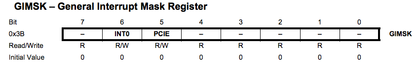

# Advanced programming. C and Assembly

## Introduction to interrupts
So far you have been dealing with polling when you need to do multiple tasks in a microcontroller. We are going to introduce interrupts. For using interrupts you need to add the interrupt library in the header of your C code:

`#include <avr/interrupt.h>`

Then we have to look which is the pin where we want to use the interrupt. In this case it will be a button in PA3.


There are 3 registers to set up for using interrupts. The first one in the bit 7-I of the Status REGister SREG




```C
GIMSK |= (1<<PCIE0); //Enable pin change interrupt.
PCMSK0 |= (1<<PCINT7); //pin mask
sei(); // enable global interrupt
```
And also create the interrupt routine
```
ISR(PCINT3_vect)
{
 if ( PINA & (1<<PINA7) )
  PORTB &= ~(1<<PB2); //turn off LED
 else
  PORTB |= (1<<PB2); //Turn on LED
}
```
That way the loop will be empty

### Timer interrupts
One of the problems you will find when you
---
[Back to Summary](../summary.md)
