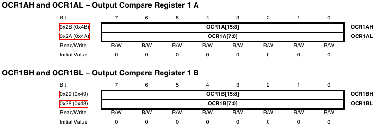
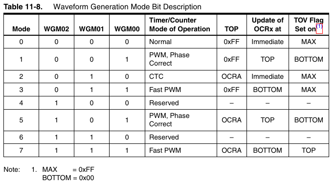

# Timer/counters in the attiny44
The timer/counter is a piece of hardware inside the microcontroller that can be used to count and control time. Actually, it does not count time, because it doesn't know anything about time. It should be actually named counter because it just counts clock cycles. What makes timers so interesting is the fact that they are totally independent of the CPU. The timers run parallel to the CPU without its intervention.

> Note: All the information listed here is a extract from the attiny44 datasheet. It just organized differently in order to be easier to understand. Other microcontrollers will have different register names.

## The problem of the blinking LED
Let's see the classical blinking LED code, where we have an LED in PA3, connected to ground.
```C
#include <avr/io.h>
#include <util/delay.h>

int main (void) {
    DDRA |= (1 << PA3); // set LED pin as output

while(1) {
      PORTA |= (1 << PA3);  // turn on the LED
      _delay_ms(1000);      // wait a second
      PORTA &= ~(1 << PA3); // turn off the LED
      _delay_ms(1000);      // wait a second
         }
  }
  ```
The problem when counting time this way, is that the microcontroller cannot do anything else while we are waiting with the delay. As your coding abilities increase you will notice a limitation in what you can achieve due to this problem. In fact, you should NEVER use delays.

## The timers/counters
The ATtiny44 has two independent internal timers. One 8-bit (TIMER0) and another 16-bit (TIMER1), each with 2 PWM channels (more on this [later](pwm.md)). **Timers are actually registers** that increase automatically from zero to 255, for the 8-bit `TCNT0`:


Or from 0 to 65535, for the 16-bit register `TCNT1`, which in reality is splitted in two 8-bit registers, high and low:


When they reach the maximum value, they overflow back to zero and start counting again. So far, so good.

## The Prescaler
By default the timer registers increment at the speed of the microcontroller (if a clock speed of 1 MHz is used, then 1,000,000 times per second). So at every tick of the clock you count 1/1000000 s. That is an impressive resolution. The problem is that the register `TCNT0` is going to overflow too fast, exactly at 0.000256 s.

Somehow we need to slow down the speed at wich the counter is updating. We can do so by dividing the speed by a certain amount. This is called prescaling. The prescaler can be set to 8, 64, 256 or 1024 compared to the system clock.

If we set the prescaler to 1024. Then the register `TCNT0` will increase the count every 1024 clock cycles, thus 1024/1000000 = 0.001024 s and will overflow at 0.262144 s.

### Setting the prescaler for TIMER0
The prescaler for TIMER0 is set using the control register `TCCR0B`:


### Setting the prescaler for TIMER1
The prescaler for TIMER1 is set using the control register `TCCR1B`:


> WARNING! Once you set the prescaler, the counter will start!

Let's see an example of using TIMER0 to blink an LED every 124 counts at 1024 prescaler.

```C
#include <avr/io.h>

int main(void)
{
    // connect led to pin PA3
    DDRA |= (1 << PA3);

    // initialize timer
    // set up timer with prescaler = 1024
    TCCR0B |= (1 << CS02)|(1 << CS00);

    // initialize counter
    TCNT0 = 0;

    // loop forever
    while(1)
    {
        // check if the timer count reaches 124
        if (TCNT0 >= 124)
        {
            PORTA ^= (1 << PA3);    // toggles the led
            TCNT0 = 0;            // reset counter
        }
    }
}
```


## Operation modes
Timers have different modes of operation. We will focus in two for now: Normal mode and CTC mode. Let's explain what these modes do, one at a time.

### Normal mode
By default the timers will run in this mode. They will count from 0 to their maximum value 255/65535, and then overflow. The problem with this mode is that it is uncommon that we want to count up to that specific number, that is why the have the CTC mode.


### CTC mode
This is *clear timer on compare match* mode. This is the most common case. We will load a specific value in a register and then we will count up to that number. In each timer you can set up to 2 independent values that will trigger 2 independent interrupts. These for TIMER0:


And these for TIMER1:



### Selecting the mode of Operation
Operation modes are set with the control registers TCCR0A and TCCR0B for the 8-bit TIMER0, according to the following table.




And TCCR1A and TCCR1B for the 16-bit TIMER1.


